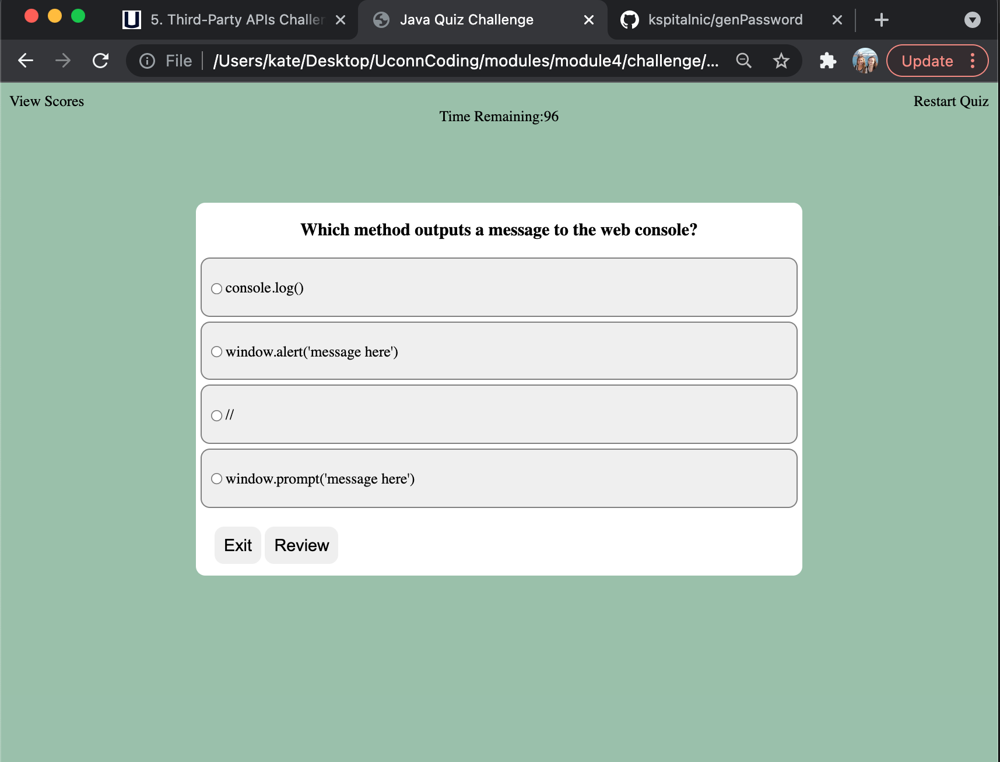

# javaQuiz

This web application consists of a quiz on JavaScript. 

## Project Features
* The score is the users final time remaining to answer the questions. 
* If the user gets a question incorrect, they will lose ten seconds from their remaining time. 
* If time runs out, the quiz will end, they will not get to log their score on the high score list, and will have to try again. 
* User receives feedback on each question (correct/incorrect). 
* High score page ranks and saves scores (locally)
* User can exit/restart the game at any time or view high scores at any time. 

Resources used: HTML, CSS, javaScript. 
Some strategies used: functions, local storage, intervals, arrays, and event listeners.

<a href="https://kspitalnic.github.io/javaQuiz/">Link to Website </a>
 
<a href="https://github.com/kspitalnic/javaQuiz">Link to Repository </a>

Screenshot:  
